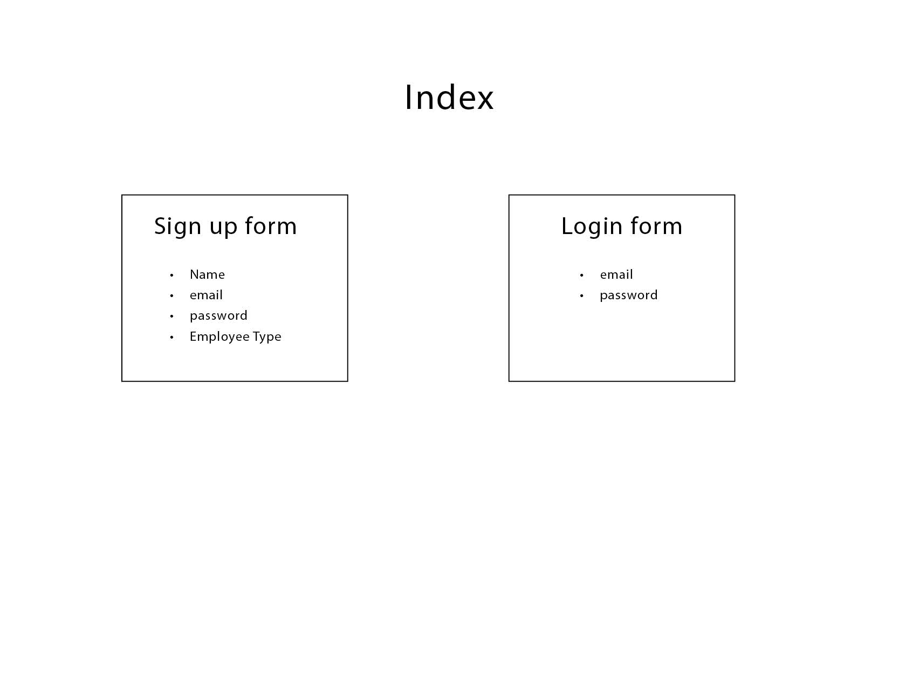
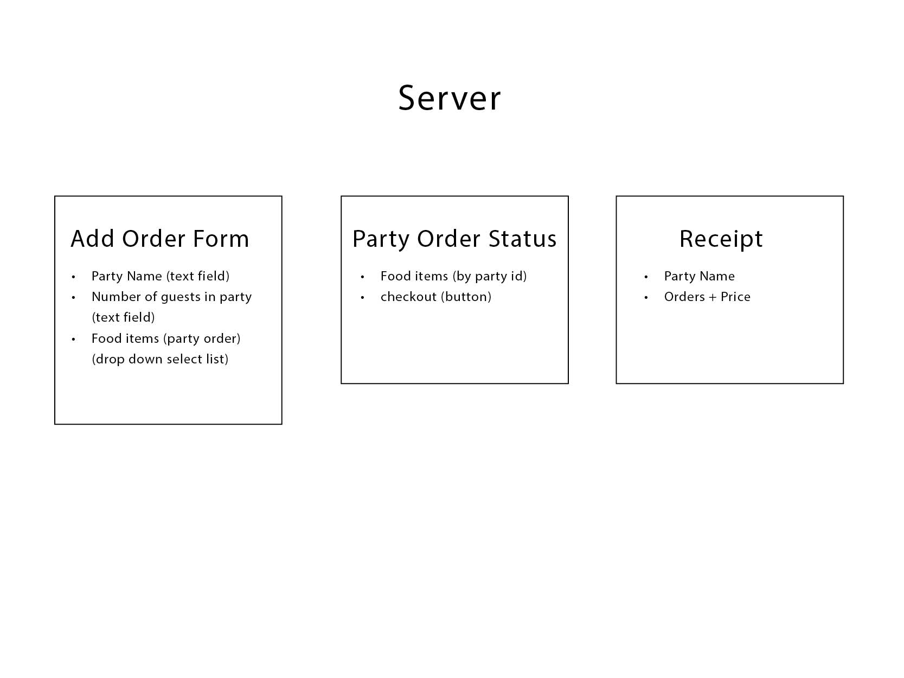
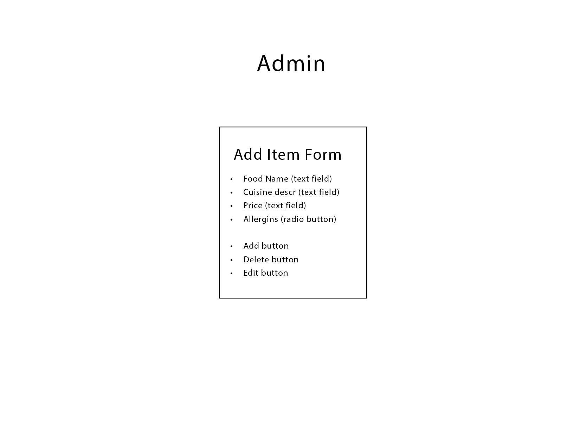
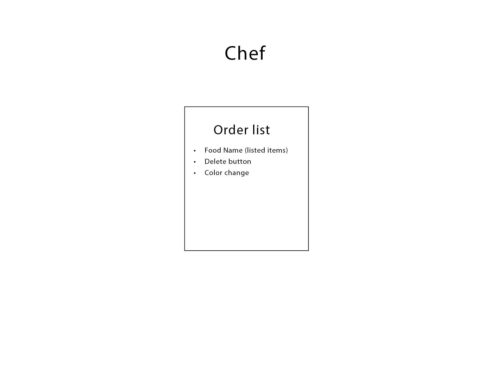
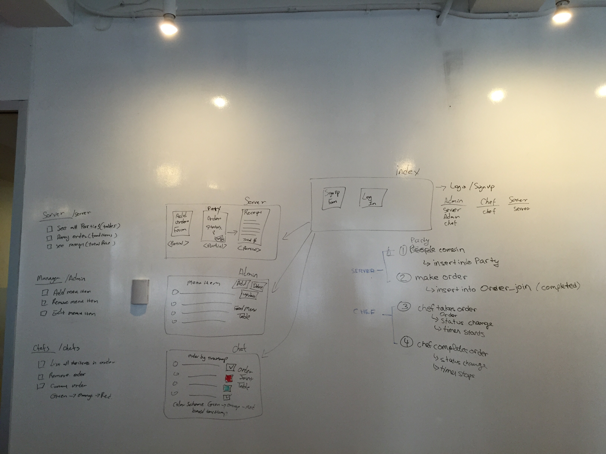
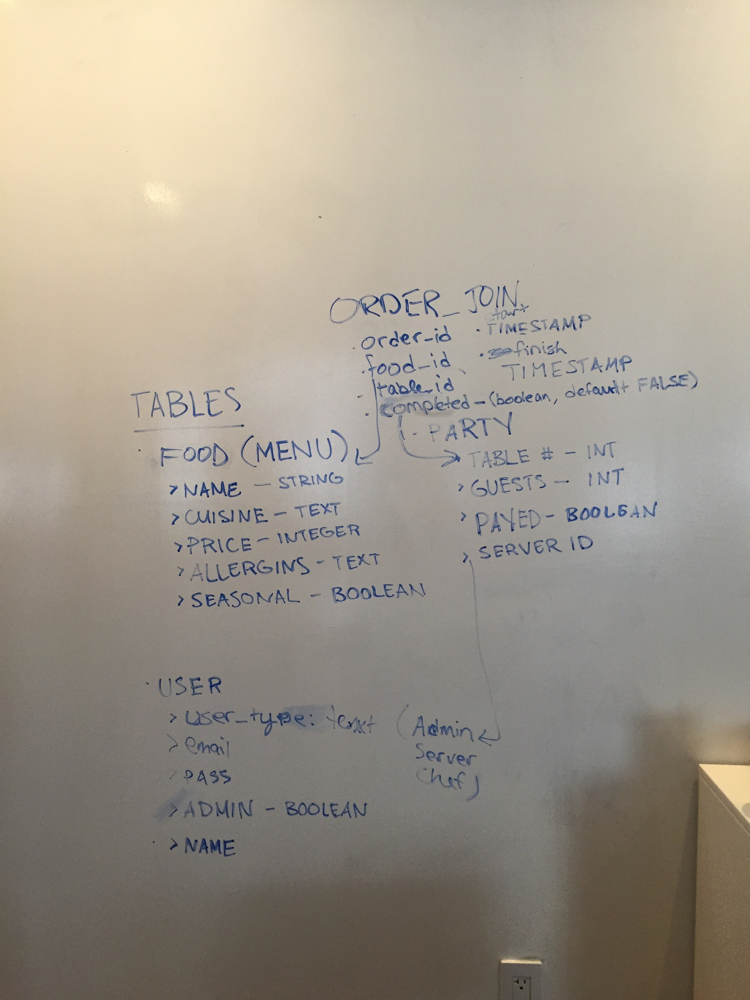
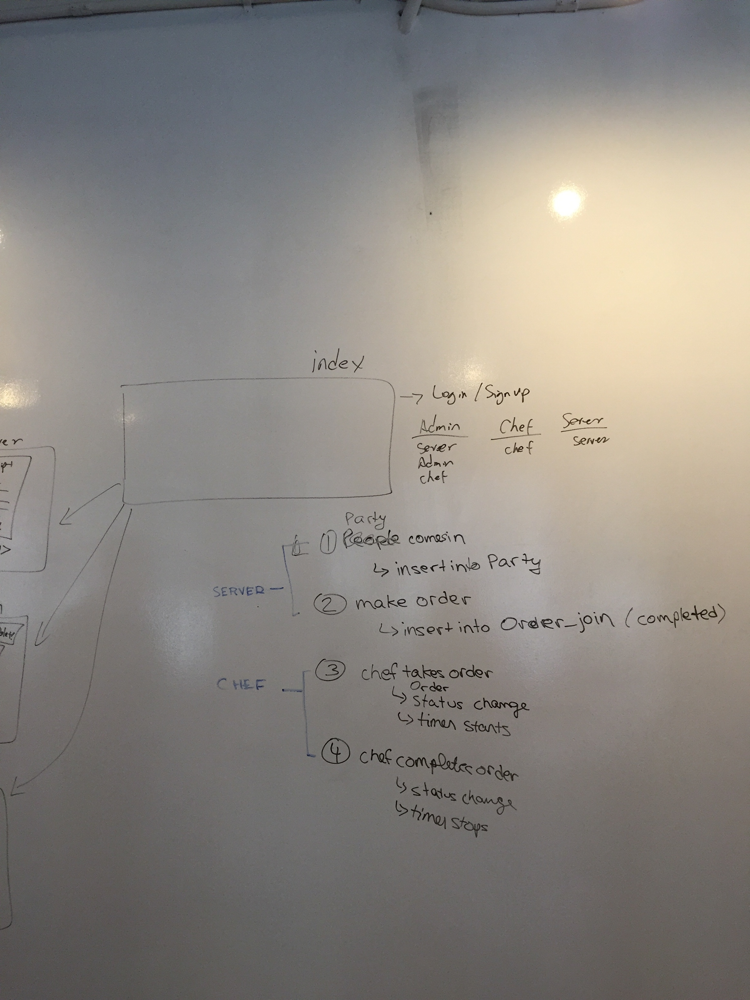

# restaurant_app
Rails app for restaurant

I am on Heroku @ :
https://restaurant-app-1.herokuapp.com/

### UserStories:
1. As a server I should be able to see all parties in restaurant

1. As a server I should be able to create an order for a party.

1. As a server I should be able to see an individual parties order.

1. As a server I should be able to get a receipt for a party.

---
1. As a manager I should be able to add a menu item

1. As a manager I should be able to edit a menu item

1. As a manager I should be able to delete a menu item

---

1. As a chef I should be able to see all items in an order

1. As a chef I should be able to remove an order when I complete it.

1. As a chef I should be able to see the time status of order by green 5mins, orange 15mins, red 30mins.

---
### Wireframes:

  

### ERD's:

### WhiteBoard Screen Shots:

